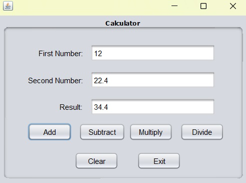
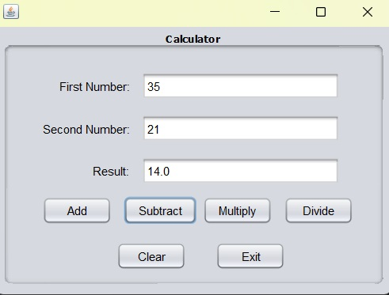
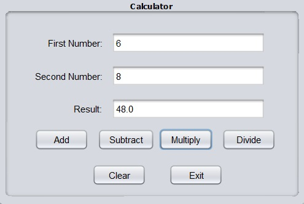
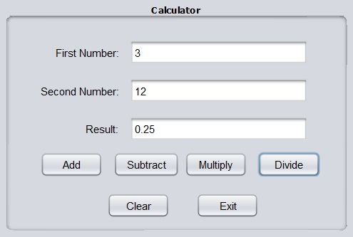

# Project Title
Calculator

## Description
This application, developed using Java Swing, allows a user to input two numbers and then select an operation — multiplication, addition, subtraction, or division — to be performed on them.

## Java version
- The project is using Java Development Kit (JDK) version 16

### Installing and Running
- Simply download the Calculator.jar file and run it

## Contact
- Full name: Manuele Tacchetti
- Email: manuele.tacchetti@gmail.com

# Screenshots

